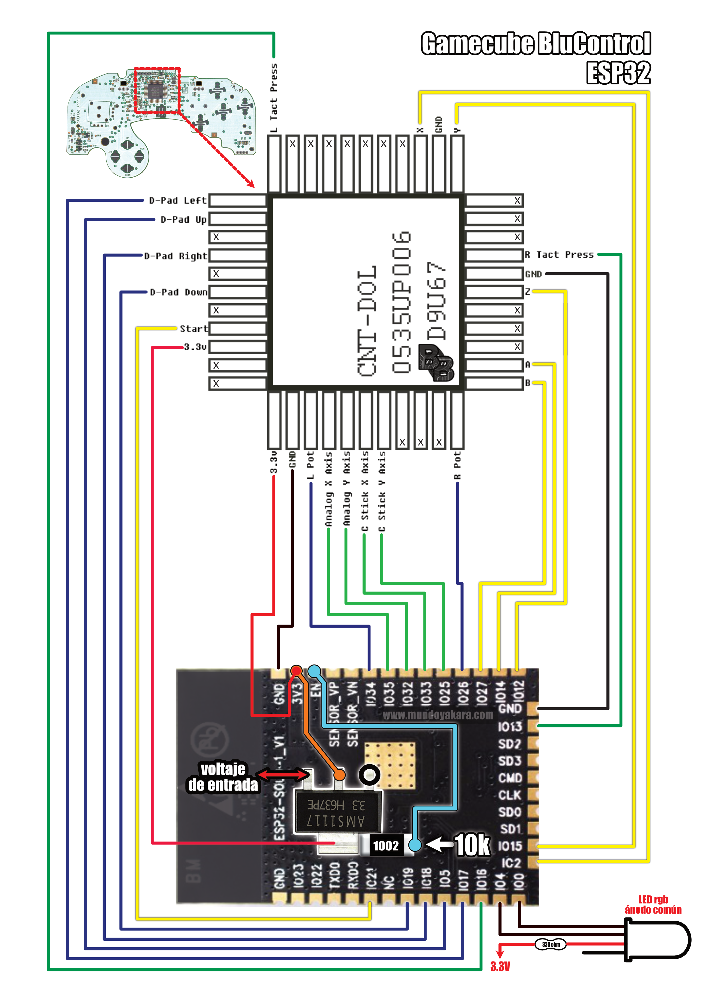

## Pinout and schematics

First you have to remove every components (resistors, IC, capacitors, jumpers, etc.). Then, you have to properly solder every button from the original IC place following the above schematic. I'd recommend you to flash the ESP32 before wiring everything.

## Using it

To switch between modes you have to press and hold **both Start and Z** for about **6 Seconds**

To enable the OTA mode, you have to power on the controller while holding **both Start and Z** and don't release them for about **6 Seconds**